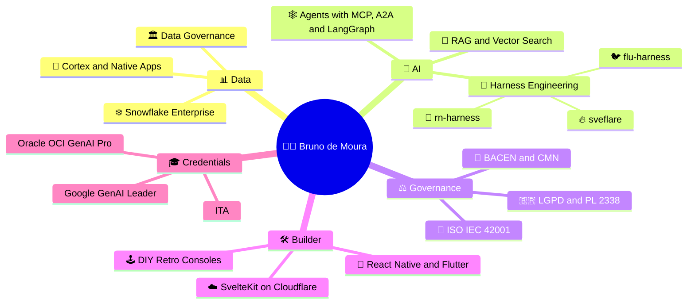
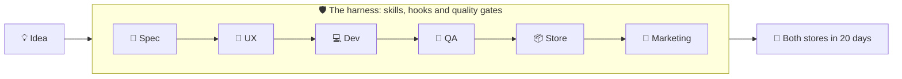

# 👋 Hi, I'm Bruno de Moura

### 🧠 Data governance veteran turned AI-agent wrangler

*~20 years in regulated finance. I teach AI to follow the rules the way banks taught everyone else: politely, and with documentation in triplicate.*

---

## 🗺️ The Short Version

---

## 🔥 What I'm Building Now

### 🧰 The Harness Lab

> Agent = model + harness. The model is 10% of the result; the harness is 90%. 🏎️

Claude is the engine. I build the car, the seatbelts and the speed limiter. One harness per stack, so far:

| | Harness | The pitch |
|---|---|---|
| 📱 | **[rn-harness](https://github.com/Jujubalandia/rn-harness)** React Native | Claude Code skills, hooks and templates that take an app from spec to App Store and Play Store in 20 days. Auto-detects your stack, enforces quality gates, and `rn-doctor` runs 24 health checks so you find the bug before the reviewer does. |
| 🐦 | **[flu-harness](https://flu-harness.netlify.app)** · [repo](https://github.com/Jujubalandia/flu-harness) Flutter | The same 20-day assembly line, Flutter edition. A wizard detects your stack across 16 dimensions, a 26-check doctor diagnoses the project, and quality gates behave identically in PowerShell, cmd and Git Bash. Windows had opinions; I documented them. |
| 🔥 | **[sveflare](https://svelflare.netlify.app)** · [repo](https://github.com/Jujubalandia/dsh-sveltekit-cloudflare) SvelteKit + Cloudflare | A DeepSeek Harness kit with 12 skills (D1, KV, R2, AI Gateway, auth, OWASP), 5 subagents (drafter, verifier, judge and two auditors) and **8 security gates** between your code and production. Because "works on my machine" is not a threat model. |

#### How the mobile harnesses work (a.k.a. why my agents behave)

*sveflare swaps the store lanes for five slash commands: spec → plan → goal → verify → ship.*

### 🤖 AI and Governance

| | Project | The pitch |
|---|---|---|
| ⚖️ | **[GOV.IA / Radar ISO 42001](https://inovahub.com.br)** | An AI governance diagnostic that crosswalks **57 requirements** across ISO 42001, PL 2338, BACEN/CMN and FSB. The platform scaffold runs on Cloudflare Workers + D1, with deterministic scoring, Claude-written reports and a `CLAUDE.md` harness keeping everyone honest. |
| 🕵️ | **BrIA** | Multi-agent due diligence on Snowflake Cortex, LangGraph, MCP and A2A, fed with Brazilian public data. Think of it as a team of tireless analysts that never ask for a raise. |
| ❄️ | **OpenDataInova** | A Snowflake Native App that serves Brazilian public data to agents over MCP, with governance built in. One dataset first. Discipline is a feature. |

---

## 🧪 Tech I Use (and Occasionally Argue With)

---

## 🎲 Plot Twists

- 🕹️ I build **DIY retro game consoles**. Hardware bugs are just data quality issues with extra smoke.
- 📵 I wrote [`scroll-block`](https://github.com/Jujubalandia/scroll-block), an app to manage my scrolling habits. Yes, I see the irony of hosting it on a social platform for developers.
- 💊 **AMYNK** is a multimodal Gemini app for medicine info, and it earned international press coverage. Not bad for a side project.
- ⚖️ I read the fine print (LGPD, ISO 42001, PL 2338) so your model doesn't get fined for it.

---

## 📬 Find Me

*Want to talk agents, governance or retro consoles? In that order. Or not. ☕*

